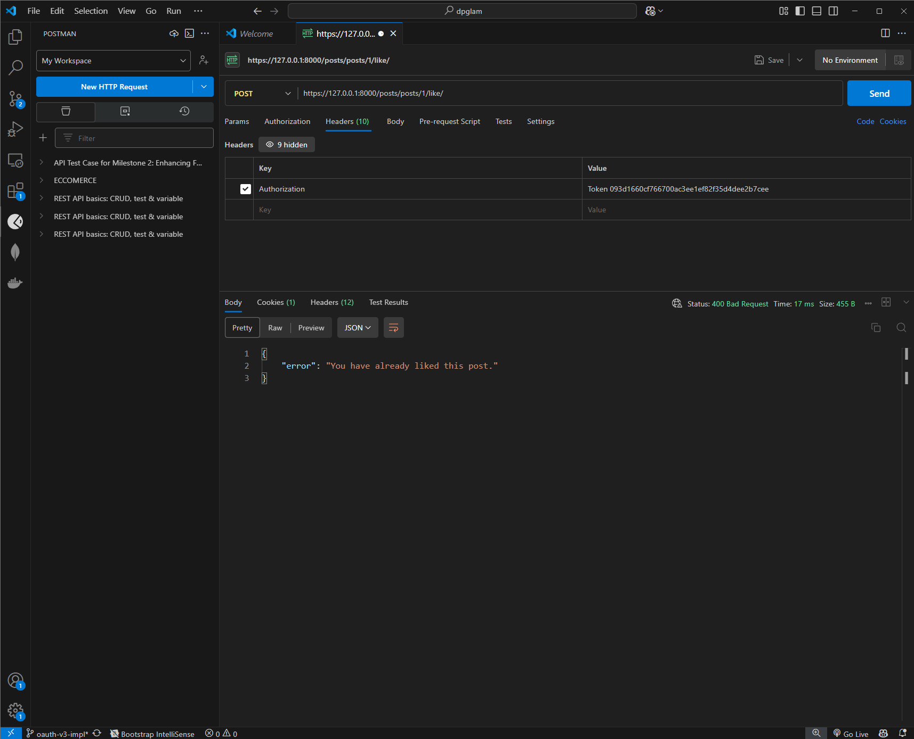
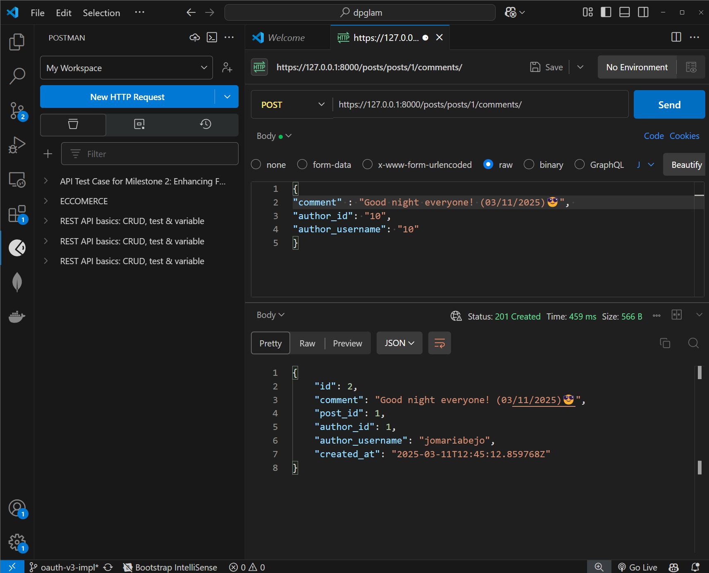
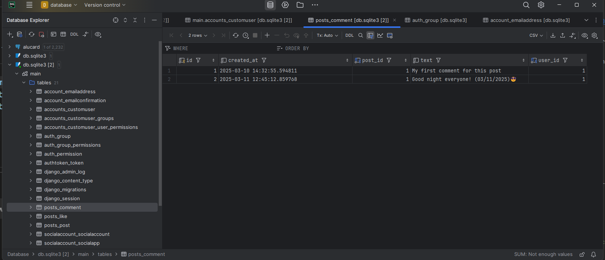
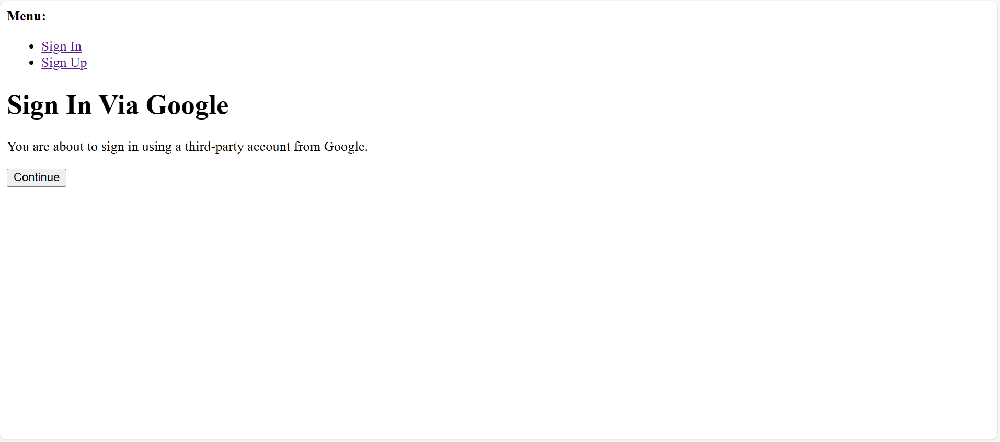
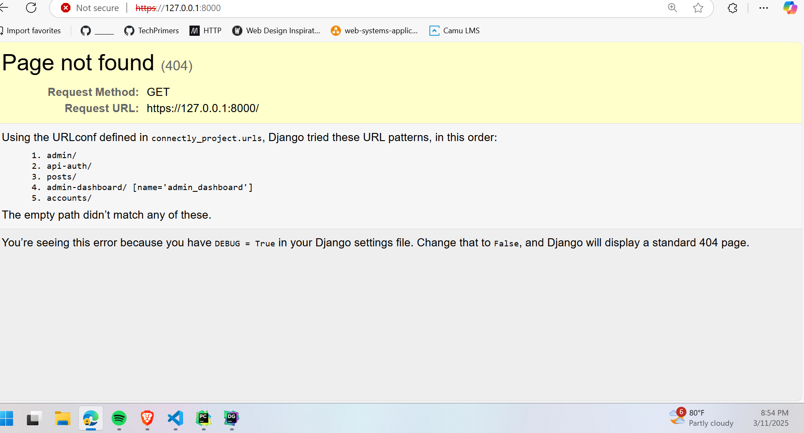
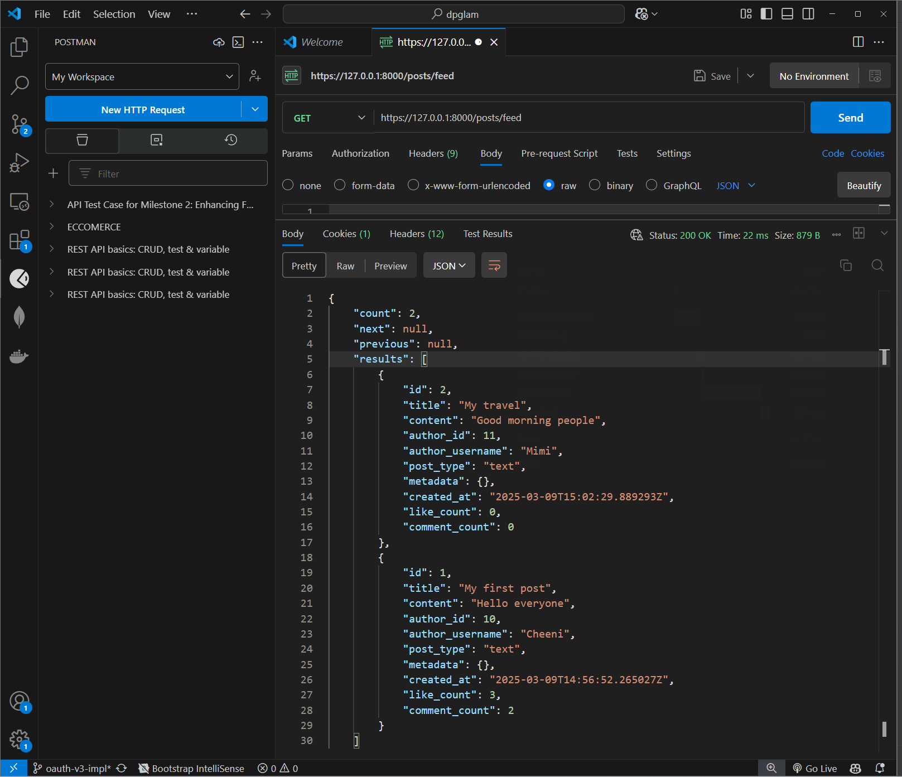

# API Test Cases Enhancing Functionality – User Features & Integrations

## Overview
This document contains test cases for verifying the functionality of the Connectly API, ensuring that all implemented features from Milestone 2 work as expected.

---

## Test Cases

### 1. Likes Functionality
#### **Test Case ID**: TC-LIKE-001  
**Feature**: Like a Post  
**Description**: Ensure that a user can successfully like a post.  
**Preconditions**:
- User must be authenticated.
- The post must exist in the database.

**Test Steps**:
1. Send a `POST` request to `https://127.0.0.1:8000/posts/posts/1/like/` with a valid authentication token.
2. Check the response status and message.
3. Verify that the like count for the post has increased in the database.

**Expected Result**: The like count accurately changes and the API returns a success message. But in this instance, it says "You have already liked this post" because I have previously liked it.

**Actual Result**: _.

**Status**: Pass✅

---

### 2. Comments Functionality
#### **Test Case ID**: TC-COMMENT-001  
**Feature**: Add a Comment  
**Description**: Ensure that a user can successfully comment on a post.  
**Preconditions**:
- User must be authenticated.
- The post must exist in the database.

**Test Steps**:
1. Send a `POST` request to `https://127.0.0.1:8000/posts/posts/1/comments/` with a valid authentication token and comment payload.
2. Check the response status and message.
3. Verify that the comment appears in the database under the correct post.

**Expected Result**: API responds with success message, and the comment appears under the post.

**Actual Result**: 

**Database Update**: 
**Status**: Pass✅

---

### 3. Google OAuth Login
#### **Test Case ID**: TC-OAUTH-001  
**Feature**: Google OAuth Authentication  
**Description**: Ensure that users can authenticate using Google OAuth.  
**Preconditions**:
- The user has a valid Google account.
- Google OAuth is configured correctly in the API.

**Test Steps**:
1. Redirect the user to Google’s OAuth consent screen.
2. Approve access and obtain an authentication token.
3. Send the token to `https://127.0.0.1:8000/accounts/login/` for validation.
4. Verify the user is successfully logged in and a session is created.

**Expected Result**: The user is authenticated, and a valid session token is returned.

**Actual Result**: 

### Before the Google oauth

### After selecting verified google account it redirects to homepage url

**Status**: Pass✅

---

### 4. News Feed Pagination
#### **Test Case ID**: TC-FEED-001  
**Feature**: Paginated News Feed  
**Description**: Verify that the news feed retrieves posts in a paginated format.  
**Preconditions**:
- The user must be authenticated.
- The database must contain multiple posts.

**Test Steps**:
1. Send a `GET` request to `https://127.0.0.1:8000/posts/feed` with a valid authentication token.
2. Check the response format and pagination metadata.
3. Verify that only the expected number of posts is returned.

**Expected Result**: The API returns the correct number of posts per page with valid pagination metadata.

**Actual Result**: 

**Status**: Pass✅

---

## Notes
- Use Postman or cURL to execute the test cases.
- Any failed test case should be documented and reported for bug fixing.

---
